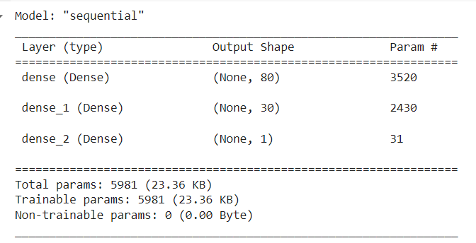
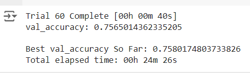
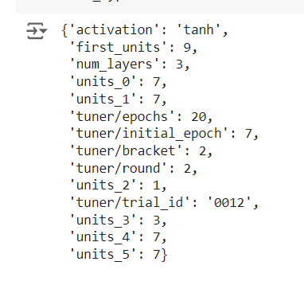
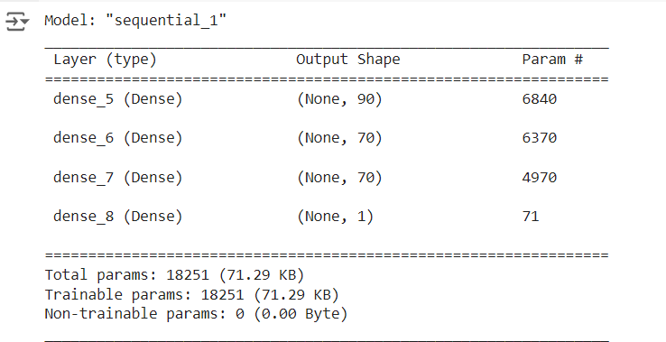

# deep-learning-challenge

#### Overview of the analysis:

The provided data is sourced from the nonprofit foundation Alphabet Soup, contained within a CSV file documenting over 34,000 organizations that have received funding from Alphabet Soup over the years. The objective of this analysis is to develop a binary classifier capable of predicting the success of applicants funded by Alphabet Soup.

#### Results: 
As part of data preprocessing:

#### Data Preprocessing:

* First, I loaded all dependencies, imported and read the charity_data.csv file, and dropped the 'EIN' and 'NAME' columns because they are neither targets nor features. Then, I proceeded with the following steps.

* I used the 'nunique' function to determine the number of unique values in each column. Based on this analysis, I identified columns that should be binned to reduce data complexity and transform them into categorical variables.

* The 'APPLICATION_TYPE' and 'CLASSIFICATION' columns were binned using a cutoff value of 500 and 1000, respectively. Values below these cutoffs were grouped and labeled as 'others'.

* Converted categorical data to numeric with `pd.get_dummies`.

* Split the preprocessed data into features and target arrays,where the 'IS_SUCCESSFUL' column is chosen as target and the remaining columns chosen as features. 

* Split the preprocessed data into a training and testing dataset.

* Both the testing and training data were scaled using 'StandardScaler'.

#### Compile, Train and Evaluate the Model:

* I defined a neural network model with two layers: the first layer has 80 nodes and the second layer has 30 nodes, both using the 'relu' activation function.

* The output layer is defined with the 'sigmoid' activation function.

* The final structure of the model looks like this.

* Compile the model with loss function as 'binary_crossentropy' andd optimizer as 'adam'.

* Train the model with 100 epochs.

* Finally evaluate the model using the test data and it provided an accuracy 0.7311.

* Exported the model to HDF5 file as 'AlphabetSoupCharity.h5'.

* Since the model did not achieve the target performance (i.e., accuracy > 75%), I implemented the following optimization steps to improve its performance:

#### Optimize the Model:

* Created a new Google Colab file and name it 'AlphabetSoupCharity_Optimization.ipynb'.

* Import your dependencies and read in the 'charity_data.csv' to a Pandas DataFrame and Preprocess the dataset as above.

* Additionally,I droped the only the, 'EIN' column and kept 'NAME' column as a feature.

* Binned the 'NAME'and 'ASK_AMT' column using a cutoff value of 100,500 respectively. Values below this cutoff grouped and labeled as 'others'.

###### Why 'NAME' and 'ASK_AMT' column?:

* In the dataset the name column has large number of unique values,so each value could have been treated as a separate category by the model, potentially causing overfitting. Binning reduces the number of categories, making the model less likely to fit noise in the data.

* Next,converted categorical data to numeric with `pd.get_dummies`.

* Split the preprocessed data into features and target arrays,where the 'IS_SUCCESSFUL' column is chosen as target and the remaining columns chosen as features. 

* Split the preprocessed data into a training and testing dataset.

* Both the testing and training data were scaled using 'StandardScaler'.

* Defined a function for the optimization:

    * Created a method that creates a new Sequential model with hyperparameter options.

    * Used kerastuner to decide which activation function to use in hidden layers(ie,'relu','tanh','sigmoid').

    * Allowed kerastuner to decide number of neurons in first layer.

    * Allowed kerastuner to decide number of hidden layers and neurons in hidden layers.

    * Using the kerastuner search for best hyperparameters.

    * With the help of keras tuner I could find the best parameters for obtaining the target accuracy.

        

    * So using these parameters,I defined a neural network model with three layers: the first layer has 90 nodes,the second layer has 70 nodes and the third layer has 70, all these layers using the 'tanh' activation function.

* The output layer is defined with the 'sigmoid' activation function.

* The final structure of the model looks like this.

* Compile the model with loss function as 'binary_crossentropy' and optimizer as 'adam'.

* Train the model with 100 epochs.

* Finally evaluate the model using the test data and it provided an accuracy of 0.7569 or 75%.

* Exported the model to HDF5 file as 'AlphabetSoupCharity_Optimization.h5'.

#### Summary:

* Initially, the deep learning model yielded an accuracy below 75% after preprocessing two columns and constructing a neural network with two layers (80 nodes and 30 nodes). However, after further preprocessing by binning an additional columns ('NAME','ASK_AMT') and expanding the neural network architecture to include three layers (90 nodes, 70 nodes, and 70 nodes) with 'tanh' activation function, the model achieved an accuracy greater than 75%.

* So transition from a simpler model with two layers (80 nodes and 30 nodes, both using 'relu' activation) to a deeper model with three layers (90 nodes, 70 nodes, and 70 nodes, using 'tanh' activation) helped in improving the accuracy.That is the increase in the number of layers and nodes per layer increases the model's capacity to learn complex patterns in the data, potentially improving its ability to generalize.

* The accuracy improvement from less than 75% to greater than 75% indicates that the deeper architecture and activation function change were beneficial for this dataset.

* Also binning more columns made the dataset less noisy,that also helped to improve the accuracy.

#### Recomentation:

* Experimenting with different activation functions can help you identify which one works best.

* Regularization techniques such as dropping and binning columns will reduce the data complexity.

*  Continue to explore hyperparameters such as number of epochs, and optimizer choice (e.g., Adam, SGD) to further improve performance.

